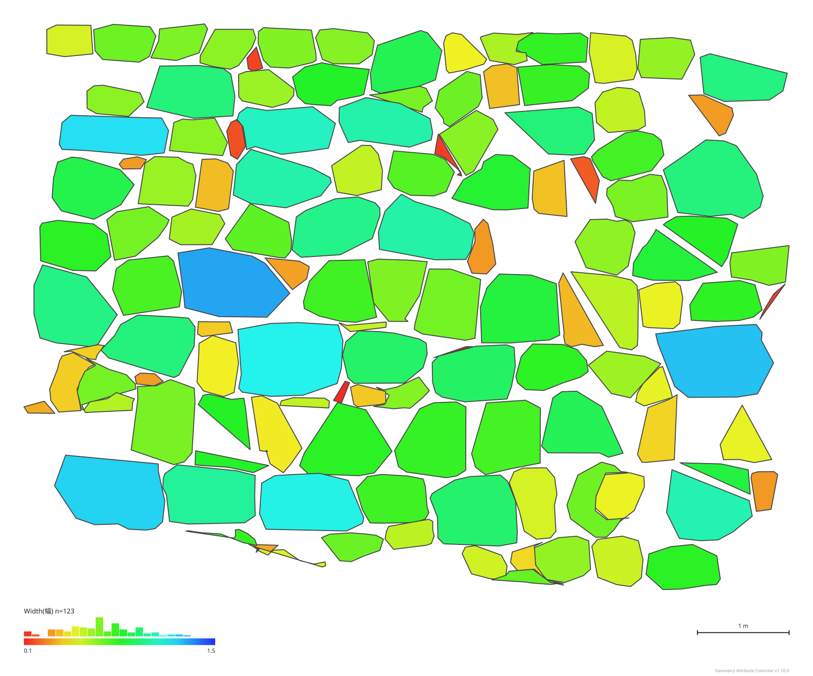

# Geometry Attribute Colorizer

ブラウザだけで動く、3Dジオメトリの属性計算・色分けビューアーです。



<sub>内蔵サンプル(石垣69個)を幅で色分けし、立面図SVGとして書き出したもの。このアプリ自身の出力です。</sub>

石垣などの3D輪郭データ(DXF)を読み込むと、各輪郭の幅・高さ・面積・矩形充填率・
傾斜角・矩形回転角を**その場で自動計算**し、属性の値に応じて色分け表示します。
Rhino/Grasshopperなどから書き出した3Dモデル(GLB)+CSV属性の組み合わせにも対応しています。
フォトグラメトリモデル(OBJ+テクスチャ)を背景として重ねて表示することもできます。

インストール不要・サーバーへのアップロード無しで、すべてブラウザ内で処理されます。

**▶ アプリを開く: https://reisyu.github.io/geometry-attribute-colorizer/**

読み込むファイルは一切サーバーへ送信されません。まず何ができるか見たい場合は、
上のリンクを開くだけで内蔵サンプルが表示されます(ファイルの用意は不要です)。

## できること

### 読み込みと属性計算
- **DXF(閉じた3Dポリライン)の読み込みと属性の自動計算**
  - 最適フィット平面への投影(輪郭が完全な平面でなくてもOK)
  - 最小外接矩形を回転キャリパー法で厳密に計算
  - 大規模データ(1万輪郭規模)もプログレスバー表示で快適に処理
  - 平面直角座標系などの大きな座標は自動で原点シフト(表示精度の確保)
- **GLB(glTF 2.0バイナリ)の3D表示** — 回転・パン・ズームで閲覧
- **CSV属性との自動マッチング** — CSVのID列とオブジェクト名を突き合わせて属性を紐づけ
- **フォトグラメトリモデルの重ね表示** — OBJ + MTL + テクスチャ画像を読み込み、
  輪郭・色分けを実物のテクスチャモデルに重ねて表示。不透明度の調整・表示切替が可能。
  **フォルダごと選択**すれば一式が自動収集されます。
  テクスチャは自動で縮小(最大2048px)されるため、大容量データでも安定して動作
- **IDの自動採番** — DXF読み込み時、立面図で左下のオブジェクトから順に
  1, 2, 3... と自動で採番(下の段から、段内は左から右)。
  元のIDはSrcID属性として保持されるため、元データとの照合も可能。
  段(コース)番号もCourse属性として保存され、段ごとの色分け・フィルタに使えます

### 色分け
- **属性による色分け** — 数値属性はグラデーション、テキスト属性はカテゴリ別カラーで自動判定
- **配色プリセット** — 赤→青 / 赤→緑 / 黄→青 / グレースケール / カスタム(3色グラデーション対応)
- **カテゴリ色** — テキスト属性は識別性の高い20色+自動生成で何種類でも色分け可能。
  「上位7カテゴリのみ色分け(残りはその他)」オプションで、種類が多い属性も読みやすく表示
- **傾きライン** — 各オブジェクトの外接矩形の水平軸に沿った中心線を、
  矩形回転角に応じた色(0°=青、±45°=赤。変更可)と太さ(20〜100mm実寸)で描画。
  線が水平に揃っていれば整った積み方、乱れていればランダムな積み方だと読み取れます
- **グラデーションの反転** — チェック1つで色の向きを逆転
- **範囲の手動指定** — グラデーションの最小値・最大値を固定(外れ値対策、モデル間の基準統一)
- **設定の即時反映** — 一度色分けを実行した後は、配色・範囲などの変更が即座に反映
- **凡例 + ヒストグラム** — グラデーションバーの上に分布ヒストグラムを表示。
  各ビンは実際の色分けと同じ色で塗られ、どの色の石が何個あるかが一目で分かる
- **フィルタ** — 任意の数値属性の範囲条件(複数可)や自己交差の有無で石を絞り込み。
  除外した石は半透明または非表示で表現

### 表示・確認
- **クリックで属性表示** — オブジェクトをクリック(タップ)すると属性一覧を表示。
  選択したオブジェクトはオレンジの輪郭でハイライトされます
- **視点プリセット** — 「正面」(立面図SVGと同じ向き)・「上面」・「全体」ボタンでワンクリック移動
- **平行投影への切り替え** — 透視投影(既定)⇄平行投影(パースなし)をワンクリックで切り替え。
  向き・ズームは保ったまま切り替わる。「現在のビューをSVGで保存」の書き出し結果にも連動する
- **軸ギズモ・投影方式インジケータ** — ビュー右下に、元データのX/Y/Z軸が現在どちらを
  向いているかを表示。平行投影に切り替えている間はラベルでも明示
- **ダーク / ライトテーマ** — ビュー右上のボタンで背景色を切り替え(投影・印刷向け)
- **ラベル表示** — 各オブジェクトの位置にIDや属性値を常時表示
  (複数属性の同時表示、文字サイズ調整、遠いラベルの自動非表示)

### 書き出し
- **CSV書き出し** — 自動計算した属性(または読み込んだ属性)をCSVとして保存。
  「データ名」を設定しておくと全行にDataset列として付与され、複数の調査データを
  BIツールやPython(pandas)で結合したときの由来識別に使えます
- **ID付きGLB書き出し** — オブジェクト名(ID)を保持したGLBを書き出し。
  法線の向きは壁全体で自動的に統一されます。
  Blender・Rhinoなど他ツールでの再利用が可能(DXF→GLB変換としても使えます)
- **立面図SVG書き出し** — モデルの正面から見た平行投影の立面図を、
  完全なベクター(SVG)として書き出し。含める要素(凡例・スケールバー・ラベル・傾きライン)を
  選択でき、輪郭線の太さ(mm実寸)指定や、塗りつぶしなしの線画モードにも対応。
  Illustrator等で後編集できます
- **現在のビューSVG書き出し** — 立面図とは別に、現在のカメラの向き・ズームをそのまま使って
  ベクター書き出し。透視投影ならパースあり、平行投影ならパースなしで出力されます。
  凡例・ラベル・傾きラインの設定は立面図と共通。縮尺が一定とは限らないためスケールバーは非対応

## 自動計算される属性(DXF読み込み時)

| 属性名 | 日本語名 | 内容 |
|---|---|---|
| Width | 幅 | 最小外接矩形の2辺のうち、水平に近い方の辺の長さ |
| Height | 高さ | 最小外接矩形の2辺のうち、鉛直に近い方の辺の長さ |
| Area | 面積 | フィット平面に投影した輪郭の面積 |
| FillRate | 矩形充填率 | 輪郭の面積 ÷ 外接矩形の面積(1に近いほど矩形に近い形) |
| Tilt | 傾斜角 | 面の法線と鉛直(+Z)のなす角。0°=水平な面、90°=垂直な面 |
| RectAngle | 矩形回転角 | 外接矩形の水平辺が面内の水平基準から回転している角度。反時計回り(右上がり)がプラス、±45°の範囲 |
| Flatness | 平面性 | フィット平面からの最大ズレ距離。大きいほど平面近似の信頼性が低い |
| SelfIntersect | 自己交差 | 輪郭の辺同士が交差していれば1、正常なら0 |
| X / Y / Z | 重心座標 | 輪郭重心の座標(原点シフト前の元の値)。Zで色分けすると標高表示になる |
| SrcID | 元ID | 読み込み時のレイヤー名由来のID(自動採番で振り直される前の値) |
| Course | 段 | 立面図で下から数えた段(コース)番号 |

アプリ内では `Width(幅)` のように英語名+日本語名が併記され、
属性を選ぶと定義の説明が表示されます。

## サンプルデータ

- アプリを開くと、内蔵の石垣サンプル(68石・6段・後傾18°)が自動で表示されます
- リポジトリの [`sample_ishigaki.dxf`](./sample_ishigaki.dxf) をダウンロードして
  読み込めば、DXFワークフロー(自動属性計算・原点シフト)を試せます

## 使い方

### DXFから始める場合(属性を自動計算)

1. **DXFファイルを読み込む** — ビューポートにドラッグ&ドロップ(またはパネルから選択)
2. 属性が自動計算され、そのまま色分け表示されます(手順2のCSV読み込みは不要)
3. 「3. 色分けする」で対象属性・配色・範囲を調整(変更は即座に反映)
4. 「7. 書き出す」からCSVやID付きGLB、SVGとして保存できます

### フォトグラメトリモデルを重ねる場合

1. **先にDXFを読み込む**(原点シフト量がここで決まり、背景と位置が揃います)
2. 「フォトグラメトリモデルを重ねる」から **.obj / .mtl / テクスチャ画像を
   すべてまとめて選択**(ビューポートに一式まとめてドロップも可)
3. 読み込み後、不透明度スライダーで背景の見え方を調整できます
4. 背景は表示専用です(クリック判定・色分け・書き出しの対象にはなりません)

### GLB + CSVから始める場合

1. **GLBファイルを読み込む** — ビューポートにドラッグ&ドロップ
2. **CSVファイルを読み込む** — ID列を確認
3. **色分けを実行** — 属性と配色を選ぶ

### ビューポートの操作

| 操作 | 動作 |
|---|---|
| 左ドラッグ / 1本指ドラッグ | 回転(画面中央に見えているものを中心に回ります) |
| 右ドラッグ / Shift+ドラッグ / 2本指ドラッグ | パン(平行移動) |
| ホイール / 2本指ピンチ | ズーム(マウスカーソルの位置を中心に拡大縮小) |
| クリック / タップ | オブジェクトの属性を表示 |
| ダブルクリック / ダブルタップ | その位置を回転中心に設定 |

iPad等のタッチデバイスにも対応しています。

### 色分けのヒント

- **RectAngle(矩形回転角)** はプラスマイナスの値を持つため、「範囲を手動で指定」で
  最小値 -45 / 最大値 +45 に固定し、カスタム配色で赤→白→青の3色(中間色を使う)にすると、
  左傾き=赤 / 水平=白 / 右傾き=青 という直感的な表現になります
- 外れ値で色が潰れるときは「範囲を手動で指定」で範囲を絞ってください

## データの準備方法

### DXFファイル(石垣輪郭などの場合)

- **POLYLINE / VERTEX形式のポリライン**で構成されている必要があります。
  閉じた3Dポリラインのほか、**Rhino等が書き出す2Dポリラインにも対応**
  (傾いた座標系(OCS)は自動でワールド座標に変換されます)
- 1つの輪郭 = 1つのオブジェクトとして扱われます
- **レイヤー名の末尾の数字がIDになります**(例: `Layer123` → ID `123`)
- 輪郭は完全な平面である必要はありません(最適フィット平面に投影して計算します)
- Z軸が鉛直(上方向)、XY平面が水平であることを前提に、幅・高さ・傾斜角・回転角を判定します

### OBJファイル(フォトグラメトリモデル)

- .obj / .mtl / テクスチャ画像(PNG/JPG)を**同時にまとめて選択**してください
  (MTL内のテクスチャ参照は、ファイル名で自動的に対応づけられます)
- 座標系はDXFと同じ(Z軸が鉛直、平面直角座標系などの実座標)を想定しています
- テクスチャは読み込み時に最大2048pxへ自動縮小されます

### GLBファイル

- **glTF 2.0のバイナリ形式(.glb)** に対応(.gltf + .bin の分離形式は非対応)
- **オブジェクト名がCSVのIDと一致している必要があります**
  - `Cell_1` のような接頭辞付きの場合は「オブジェクト名の接頭辞」欄に指定

### CSVファイル

- 1行目はヘッダー(列名)、ID列+任意の数の属性列
- 属性は数値・テキストのどちらでも扱えます(自動判定)

```csv
ID,Area,Width,Height
1,0.113581,0.52,0.31
2,0.246072,0.68,0.45
```

## 想定ワークフロー(石垣調査の例)

1. 石垣をフォトグラメトリで3Dモデル化
2. クラスタリングで各石の輪郭を抽出し、DXFとして書き出し
3. **本アプリにDXFを読み込むと、各石の幅・高さ・面積・矩形充填率・傾斜角・
   矩形回転角が自動計算され、属性に応じて色分け表示される**
4. 必要に応じてCSVやID付きGLBで書き出し、他ツールで分析・再利用

## プライバシーについて

読み込んだファイルは**すべて利用者のブラウザ内だけで処理**されます。
外部サーバーに送信されることはありません。

## 動作環境

- モダンブラウザ(Chrome / Edge / Firefox / Safari の最新版)
- iPad / タブレット対応(タッチ操作・ファイル選択)
- WebGL対応環境

## ライセンス

MIT License — 詳細は [LICENSE](./LICENSE) を参照してください。

## 使用ライブラリ

- [Three.js](https://threejs.org/) (MIT License) — 3D表示
- [PapaParse](https://www.papaparse.com/) (MIT License) — CSVパース
